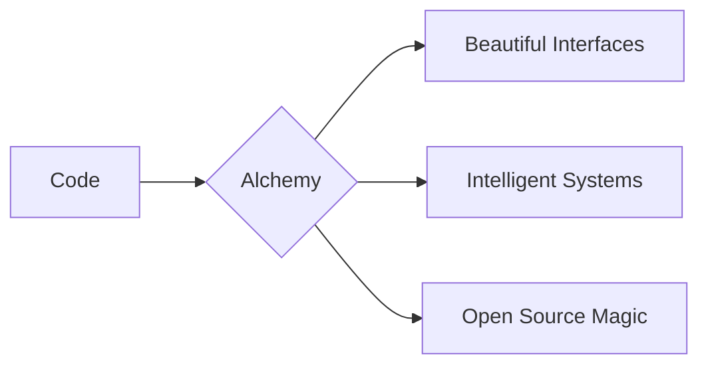

# **Sayman Lal**  
**Developer | Author | Entrepreneur**  

Welcome to my digital forge where I transmute ideas into reality through code, creativity, and cutting-edge technology. Founder of [AIALCHEMIST](https://github.com/aialchemist-org), crafting intelligent solutions at the intersection of AI and web development.



---

## **🚀 Core Expertise**

### **🧪 Frontend Alchemy**

**Core Frameworks:**  


**Build Tools:**  


**Styling & Design:**  


**Animation & 3D:**  


---

### **🔮 AI/ML Sorcery**

**Core Frameworks:**  


**Specialized AI:**  


**MLOps:**  


---

### **🔗 Web3 Wizardry**

**Blockchains:**  


**Smart Contracts:**  


**Web3 Frameworks:**  


**Tools:**  


**Full-Stack Web3:**  


**Storage:**  


**DAOs & Governance:**  


---

### **⚗️ Backend & Infrastructure Alchemy**

**Frameworks & Runtimes:**  


**Databases:**  


**Serverless & BaaS:**  


**DevOps & Cloud:**  


**API Technologies:**  


**ORMs & Tools:**  


**CI/CD:**  


**Monitoring:**  


### **🧰 Dev Tools**


---

## **✨ Featured Creations**
| Project | Description | Tech Stack | Live Demo |
|---------|-------------|------------|----------|
| **[ALGOVisualizer](https://github.com/team-vasiliades/algovisualizer)** | DSA Visualizer | Django, HTML5/CSS/Vanilla Javascript, REST API | [Demo](https://algovisualizer.pythonanywhere.com) |
| **[ArtMart](https://github.com/praveenraj027/artmart)** | E-commerce + Social Media Platform | React, Django, TailwindCSS | [Demo](https://alchemy-ui.vercel.app) |
| **[VoteX](https://github.com/team-vasiliades/votex)** | Decentralized and Secured Voting System | Solidity, Ether.js, Next.js | [Demo](https://quantum-ai.vercel.app) |

---

## **📊 GitHub Analytics**
<div align="center">
  
  
  
</div>

---

## **🏆 Achievements**
- 🥈 **1st Runner Up** at Genethon 2024 (Team Lead)
- 🎤 **UiPath GGITS Introduction Session** Speaker (2025)
- 🏅 **5+ Open Source Contributions** to major projects
- 📚 Published **1 Poetry book** on love

---

## **🌐 Connect With Me**
[](https://worksofsayman.vercel.app)
[](https://linkedin.com/in/worksofsayman)
[](https://twitter.com/worksofsayman)
[](mailto:businesssayman@gmail.com)
[](https://wa.me/+919179387285?text=Hi%20Sayman!%20I%20saw%20your%20GitHub%20profile)

---

## **💡 Currently Brewing**
- 🔥 Building an AI-powered **assistive operating system**
- 📝 Writing a **technical book** on modern web technologies
- 🌱 Learning **Low Level Programming** and **Ethical Hacking**

```python
# My current coding ritual
while True:
    code()
    debug()
    coffee.refill()
    if idea.brilliant():
        implement()
```

---

⭐ **Pro Tip:** Check out my [AIALCHEMIST](https://aialchemist.vercel.app/) organization for cutting-edge AI projects!

---


